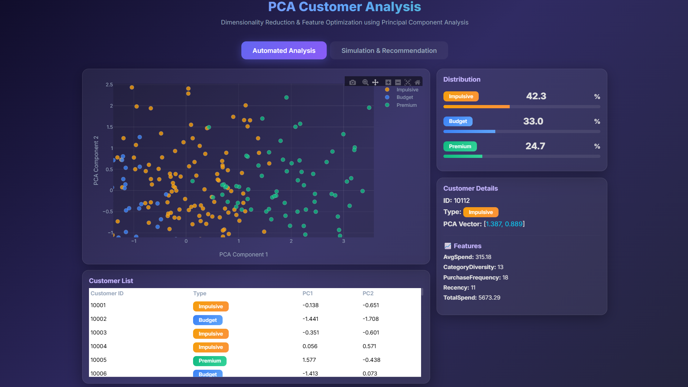
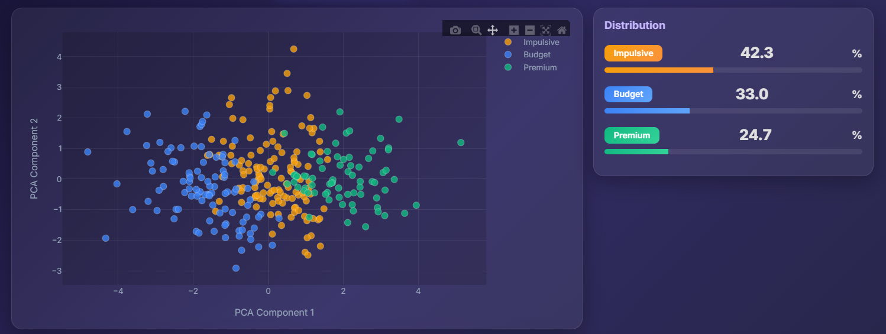
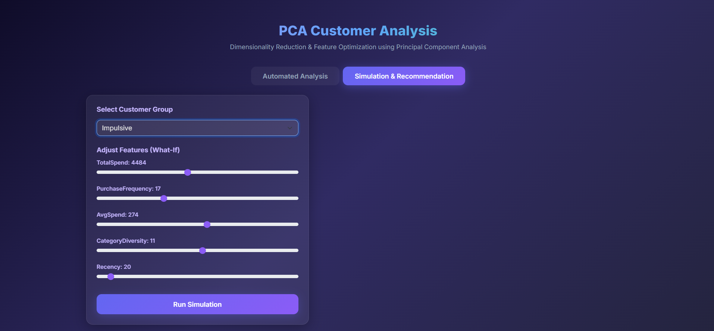
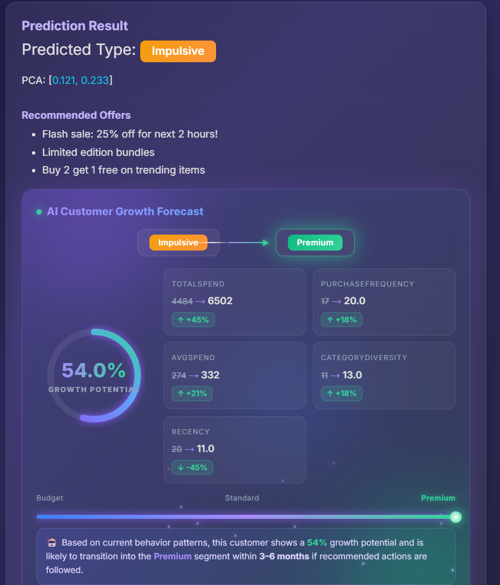

# PCA Customer Analysis

An AI-powered customer segmentation and behavioral forecasting dashboard built using Principal Component Analysis (PCA), interactive simulations, and intelligent recommendation systems.

This project transforms raw customer behavior data into actionable business insights through dynamic visualization, customer clustering, predictive simulations, and futuristic analytics dashboards.

---
# Project Preview

## Main Dashboard


## Automated Analysis


## Simulation Engine


## AI Customer Growth Forecast


---

# Project Overview

PCA Customer Analysis is designed to help businesses:

* Analyze customer behavior patterns
* Reduce feature dimensionality using PCA
* Identify customer segments
* Simulate behavioral changes
* Forecast future customer growth
* Generate intelligent recommendations
* Visualize customer transitions interactively

The system combines Machine Learning concepts with a modern AI-inspired analytics interface to create a highly engaging and business-ready dashboard experience.

---

# Key Features

## Automated Customer Analysis

* Visualize customer clusters using PCA scatter plots
* Explore customer distributions interactively
* Inspect customer-specific feature data
* Analyze dimensionality-reduced behavioral patterns

## Simulation & Recommendation Engine

* Modify customer behavioral attributes dynamically
* Run real-time customer simulations
* Predict customer segment transitions
* Generate personalized recommendation strategies

## AI Customer Growth Forecast

* Compare current vs predicted customer states
* Visualize growth potential using animated dashboards
* Track feature improvements dynamically
* Display customer journey progression
* Generate predictive behavioral insights

## Advanced UI Experience

* Glassmorphism design system
* Animated analytics cards
* Gradient visual effects
* Interactive Plotly visualizations
* Responsive modern dashboard
* Smooth transitions and hover effects

---

# Technologies Used

## Frontend

* HTML5
* CSS3
* JavaScript
* Bootstrap 5
* Plotly.js

## Backend

* Python
* Flask

## Data Science & Machine Learning

* Principal Component Analysis (PCA)
* Customer Segmentation
* Predictive Feature Simulation

---

# System Workflow

1. Customer behavioral data is processed
2. PCA reduces high-dimensional features into optimized components
3. Customer segments are generated
4. Interactive visualizations are displayed
5. Users simulate feature modifications
6. Prediction engine evaluates behavioral transitions
7. Recommendation system generates strategic actions
8. Growth forecast dashboard visualizes future potential

---

# Project Structure

```bash
PCA-Customer-Analysis/
│
├── app.py
├── requirements.txt
├── Procfile
├── README.md
│
├── templates/
│   └── index.html
│
├── static/
│   ├── css/
│   ├── js/
│   └── assets/
│
└── dataset/
```

---

# Installation Guide

## Clone Repository

```bash
git clone https://github.com/Esakki-Raja16/PCA-Customer-Analysis.git
cd PCA-Customer-Analysis
```

---

## Create Virtual Environment

### Windows

```bash
python -m venv venv
venv\Scripts\activate
```

### Linux / Mac

```bash
python3 -m venv venv
source venv/bin/activate
```

---

## Install Dependencies

```bash
pip install -r requirements.txt
```

---

## Run Application

```bash
python app.py
```

---

# Localhost Access

Open browser:

```bash
http://127.0.0.1:5000
```

---

# Deployment

## Recommended Platform

* Render

## Deployment Stack

* Flask
* Python Runtime
* GitHub Integration

---

# Future Enhancements

* Real-time database integration
* User authentication system
* AI chatbot assistant
* PDF analytics report generation
* Cloud-hosted ML inference
* Real customer dataset upload
* Live recommendation engine
* 3D visualization support
* Advanced predictive analytics

---

# Use Cases

* Customer segmentation analysis
* Business intelligence dashboards
* Retail behavior analytics
* Marketing strategy optimization
* Consumer pattern forecasting
* Academic machine learning demonstrations
* PCA visualization projects

---

# Highlights

* Interactive PCA analytics dashboard
* Real-time simulation engine
* AI-inspired futuristic UI
* Customer growth forecasting system
* Responsive and professional design
* Business-oriented recommendation workflow

---

# Author

## Esakki Raja

Machine Learning and Full Stack Development Enthusiast focused on:

* AI-powered analytics systems
* Intelligent dashboards
* Predictive modeling
* Modern visualization interfaces

GitHub:
[Esakki Raja GitHub Profile](https://github.com/Esakki-Raja16?utm_source=chatgpt.com)

---

# Repository

[PCA Customer Analysis Repository](https://github.com/Esakki-Raja16/PCA-Customer-Analysis?utm_source=chatgpt.com)

---

# License

This project is developed for educational, research, and portfolio purposes.
